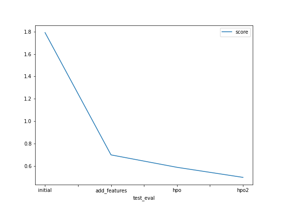

# Report: Predict Bike Sharing Demand with AutoGluon Solution
#### Greta Russi

## Initial Training
### What did you realize when you tried to submit your predictions? What changes were needed to the output of the predictor to submit your results?

Due to Kaggle requirements, we had to clip all negative predictions values to 0 (It was easy to check it via predictions.describe()).

### What was the top ranked model that performed?

The WeightedEnsemble_L3 model was always at the top of the leaderboard and improved a lot its performances via features addition and hpo.

## Exploratory data analysis and feature creation
### What did the exploratory analysis find and how did you add additional features?

The EDA let us decide to split the Datetime data into 4 additional columns: year, month, day, hour. The minutes and seconds were always 0, so there was no need to encode them. 
Also, we decided to cast the Season and Weather data to cathegorical data type.

### How much better did your model preform after adding additional features and why do you think that is?

The performances improved drastically after adding and casting features. Datetime data were much easy to interpret after splitting them, as made clear comparing the histograms:

## Hyper parameter tuning
### How much better did your model preform after trying different hyper parameters?

After hpo, the performances improved a bit. This was expectable, being hyperparameter tuning a fine-tune job, that can take a lot of trials to give great results.

### If you were given more time with this dataset, where do you think you would spend more time?

I think I would spend more time in EDA, extracting some more useful features from data.

### Create a table with the models you ran, the hyperparameters modified, and the kaggle score.

### Create a line plot showing the top model score for the three (or more) training runs during the project.

### Create a line plot showing the top kaggle score for the three (or more) prediction submissions during the project.

## Summary

With this project we aimed to solve a regression problem to predict the bike sharing demand using historical data, and upload it to Kaggle. We did apply EDA and run the process on Aws Sagemaker studio. We applied Autogluon models and tuned their hyperparameters to improve performances, with a final score of 0.498 RMSE 
